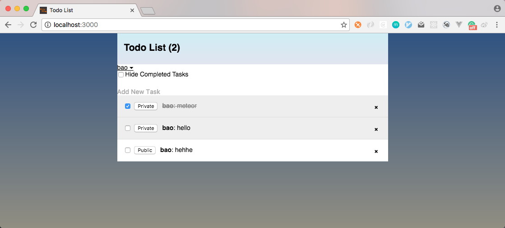
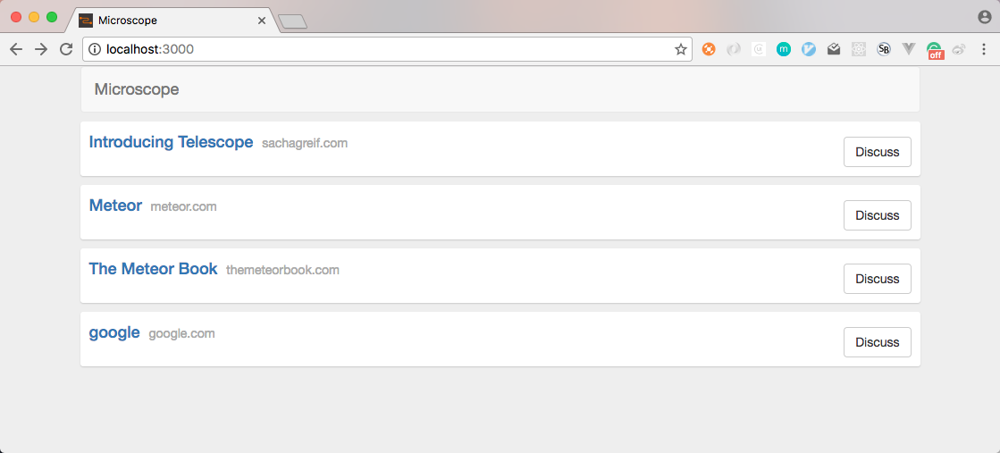

# Study Meteor

## Note

1. [Meteor Study Note](./note/meteor-study-note.md)

## Samples

### `simple-todos`

A simple todo list sample by meteor and react follow [meteor offical tutorial](https://www.meteor.com/tutorials/react/creating-an-app).

### `microscope`

A simple HN-like or Reddit-like sample follow [**Discover Meteor**](http://zh.discovermeteor.com/).

