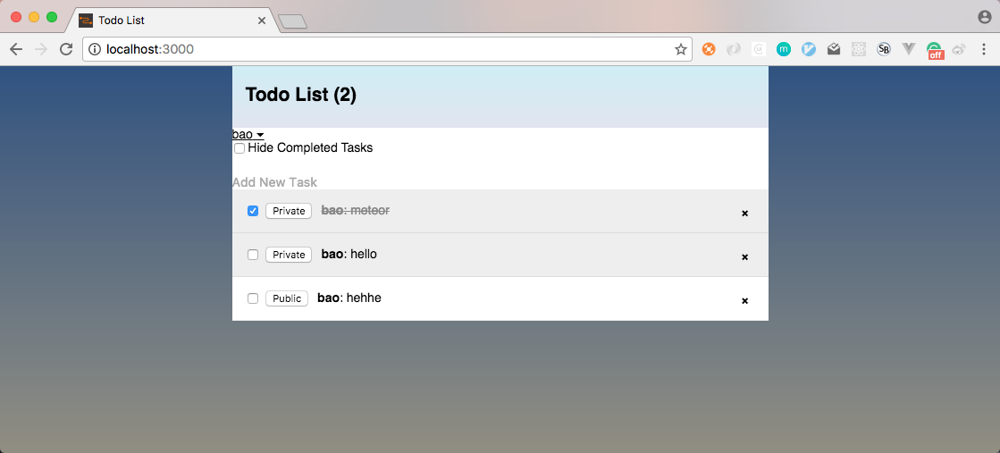
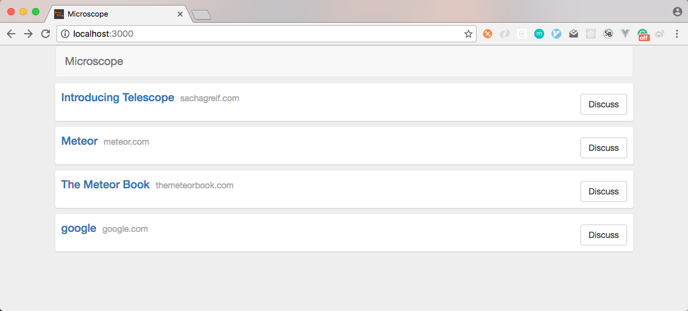

# Meteor Study Note

## Reference

1. [Meteor Official Tutorial](https://www.meteor.com/tutorials/react/creating-an-app)
1. [Discover Meteor](http://zh.discovermeteor.com/)

## Samples

### `simple-todos`

A simple todo list sample by meteor and react follow [meteor offical tutorial](https://www.meteor.com/tutorials/react/creating-an-app).

### `microscope`

A simple HN-like or Reddit-like sample follow [**Discover Meteor**](http://zh.discovermeteor.com/).

## Note

The following note is mainly for and from [**Discover Meteor**](http://zh.discovermeteor.com/).

### 集合

    Posts = new Mongo.Collection('posts');

集合：

- 同时在服务器和客户端执行，但代表意义是不一样的。
- 在服务器，集合有一个任务就是和 Mongo 数据库联络，读取任何数据变化。 在这种情况下，它可以比对标准的数据库。
- 在客户端，集合是一个安全拷贝来自于实时一致的数据子集。客户端的集合总是（通常）透明地实时更新数据子集。

console & shell：

- terminal console 
- 浏览器 console：客户端的 `console.log()` 输出到这里
- `meteor shell`：接触到服务器代码
- `meteor mongo`：直接操作服务器上的 Mongo 数据库

服务器端的集合：  

- 在服务器端，集合可以像 API 一样操作 Mongo 数据库。在服务器端的代码，你可以写像 `Posts.insert()` 或 `Posts.update()` 这样的 Mongo 命令，来对 Mongo 数据库中的 posts 集合进行操作。

        $ meteor mongo         // 直接操作数据库，使用的是 Mongo 的语法
        > db.posts.insert({title: "A new post"});
        > db.posts.find();
        { "_id": ObjectId(".."), "title" : "A new post"};

        $ meteor shell         // 操作服务器代码，类似 rails 中的 `rails c` 命令
        > Posts.find()         // 可是可以，但得到的不是直接的结果，而是一个 meteor 内部游标对象
        > Posts.find().fetch() // 这样可以得到数组

客户端集合：  

- 当你在客户端申明 `Posts = new Mongo.Collection('posts');` 你实际上是创建了一个本地的，在浏览器缓存中的真实的 Mongo 集合。当我们说客户端集合被"缓存"是指它保存了你数据的一个子集，而且对这些数据提供了十分快速的访问。
- 有一点我们必须要明白，因为这是 Meteor 工作的一个基础：通常说来，客户端的集合的数据是你 Mongo 数据库的所有数据的一个子集（毕竟我们不会想把整个数据库的数据全传到客户端来）。
- 第二，那些数据是被存储在浏览器内存中的，也就是说访问这些数据几乎不需要时间，不像去服务器访问 `Posts.find()` 那样需要等待，因为数据事实上已经载入了。

客户端-服务器端通讯：

- 在服务器端，运行 `meteor mongo` 直接操作数据库，添加或修改记录，或者查看记录；
- 在客户端，在浏览器控制台，执行一些操作，比如 `Posts.find()`, `Posts.findOne()` 来查看结果，或者执行 `Posts.insert()` 插入记录，然后回到服务器端查看结果。

服务器端的指令：

    $ meteor mongo
    > db.posts.find()

浏览器 console：

    > Posts.find()       // 得到的是游标，要用 Posts.find().fetch() 转成数组
    > Posts.findOne()
    > Posts.find().count
    > Posts.insert({})

查找与提取：

- 在 Meteor 中，find() 返回值是一个游标。游标是一种从动数据源。如果你想输出内容，你可以对游标使用 `fetch()` 来把游标转换成数组。
- Meteor 十分智能地在应用中保持游标状态而避免动不动就把游标变成数组。这就造成了你不会经常在 Meteor 代码中看到 `fetch()` 被调用（基于同样原因，我们在上述例子中也没有使用 fetch ）。

无论在服务器端控制台还是浏览器控制台，都要显式地使用 `fetch()` 来将游标转成数组，只有在代码中才不要，我试过了。

### 发布和订阅

这种架构可以让 Meteor 做更多很酷的事情，其中一件主要的就是 Metoer 变得数据库无处不在。简单说，Meteor 把你的数据拿出一部分子集复制到客户端。这样后两个主要结果：第一，服务器不再发送 HTML 代码到客户端，而是发送真实的原始数据，让客户端决定如何处理线传数据。第二，你可以不必等待服务器传回数据，而是立即访问甚至修改数据 (延迟补偿 latency compensation)。

发布和订阅，可以使用参数：

    // 在服务器端
    Meteor.publish('posts', function(author) {
      return Posts.find({flagged: false, author: author});
    });

    // 在客户端
    Meteor.subscribe('posts', 'bob-smith');

查找，`find()` 加上参数：

    // 在客户端
    Template.posts.helpers({
      posts: function(){
        return Posts.find({author: 'bob-smith', category: 'JavaScript'});
      }
    });

autopublish 的目的是让 Meteor 应用有个简单的起步阶段，它简单地直接把服务器上的全部数据镜像到客户端，因此你就不用管发布和订阅了。生产环境是一定要去掉的。

只发布部分数据，及隐藏部分字段的发布方法：

    Meteor.publish('allPosts', function(){
      return Posts.find({'author': 'Tom'}, {fields: {
        date: false
      }});
    });

### 路由

使用 Iron Router 包：

    $ meteor add iron:router

路由器的词汇： 

在本章我们会接触很多路由器的不同功能。如果你对类似 Rails 的框架有一定实践经验的话，你可能已经很熟悉大部分的这些词汇概念了。但是如果没有的话，这里有一个快速词汇表让你来了解一下。

- 路由规则（Route）：路由规则是路由的基本元素。它的工作就是当用户访问 App 的某个 URL 的时候，告诉 App 应该做什么，返回什么东西。
- 路径（Path）：路径是访问 App 的 URL。它可以是静态的（/terms_of_service）或者动态的（/posts/xyz），甚至还可以包含查询参数（/search?keyword=meteor）。
- 目录（Segment）：路径的一部分，使用正斜杠（/）进行分隔。
- Hooks：Hooks 是可以执行在路由之前，之后，甚至是路由正在进行的时候。一个典型的例子是，在显示一个页面之前检测用户是否拥有这个权限。
- 过滤器（Filter）：过滤器类似于 Hooks ，为一个或者多个路由规则定义的全局过滤器。
- 路由模板（Route Template）：每个路由规则指向的 Meteor 模板。如果你不指定，路由器将会默认去寻找一个具有相同名称的模板。
- 布局（Layout）：你可以想象成一个数码相框的布局。它们包含所有的 HTML 代码放置在当前的模板中，即使模板发生改变它们也不会变。
- 控制器（Controller）：有时候，你会发现很多你的模板都在重复使用一些参数。为了不重复你的代码，你可以让这些路由规则继承一个路由控制器（Routing Controller）去包含所有的路由逻辑。

`{{> yield }}` 指定的内容动态生成，由路由来指定这部分内容由哪个模版来填充。(rails 也是用 yield 来指定动态内容。)

新建 lib/router.js 。

使用 `pathFor` 动态生成链接。(和 rails 中的 `path_url` 一样的意思。)

等待数据：在路由中使用 `waitOn` 来订阅。

动态路由，在路由中使用参数，比如在 rails 中，`/posts/:id`，在 meteor 中也一样：

    Router.route('/posts/:_id', {  name: 'postPage',  data: function() { return Posts.findOne(this.params._id); }});

这个特殊的 `:_id` 标记告诉路由器两件事：

- 第一，去匹配任何符合 `/posts/xyz/` ("xyz"可以是任意字符) 格式的路线。
- 第二，无论 "xyz" 里面是什么，都会把它放到路由器的 params 数组中的 `_id` 属性里面去。

数据源：

1. 隐式

        {{#each posts}}
          {{> postItem}}
        {{/each}}

2. 显式

        {{#with aPost}}
          {{> postPage }}
        {{/with}}

   或者简写为： 

        {{> postPage aPost}}

使用动态的路由 Helper：

    <a href="{{pathFor 'postPage'}}" class="discuss btn btn-default">Discuss</a>

需要传递的 `_id` 参数是 `pathFor` 这个 helper 自己去找的。

404 模版：

    notFoundTemplate: 'notFound'
    Router.onBeforeAction('dataNotFound', { only: 'postPage' })

可以看出，meteor 的路由和 rails 的路由有很多相似之处。

### 会话

Session 是一个全局的响应式数据存储。它全局性的意思是全局的单例对象：这个 Session 对象在全局都是可被访问到。全局变量通常被认为不是一件什么好事，不过在刚才的例子上，Session 可以作为中央通信总线用于项目的不同地方。

修改会话 (浏览器控制台)：

    > Session.set('pageTitle', "a page title")

读取会话：

    > Session.get('pageTitle')

### 添加用户

本节学习如何使用 meteor 内置的账户模板。

安装 accounts-password 时遇到了问题，可能是 node 版本的问题。
后面的就瞄一眼就行了，以后有时间再实践。

算了，后面的不看了。大致知道它的思想就行了。工作中用到再说。
